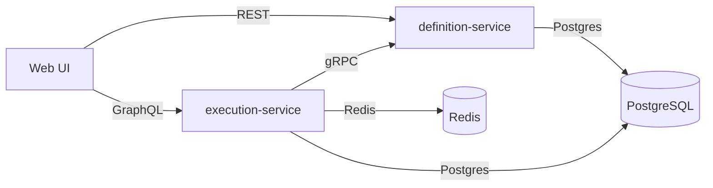

# Auctor Platform

Auctor is a policy-driven workflow execution platform for deterministic decisions, auditability, and compliance.
It separates workflow definition from execution to keep governance strict while allowing high-throughput runtime operations.

The stack ships with production-grade infrastructure, CI pipelines, and observability wiring so teams can run it in SIT with minimal glue.

## Architecture


## Tech Stack
| Layer | Tech | Version |
| --- | --- | --- |
| Definition Service | Java, Spring Boot | 21, 3.4.1 |
| Execution Service | Kotlin, Ktor | 2.2.20, 3.0.0 |
| Web | Next.js, React | 14.1.0, 18.3.0 |
| Build | Maven, Gradle | 3.9.9, 8.8 |
| Data | PostgreSQL, Redis | 16, 7.4 |
| Platform | Helm, Terraform | 3.x, 1.6+ |

## Run Locally (Docker Compose)
```bash
docker compose up --build
```

Services:
- Web UI: http://localhost:3000
- Definition API: http://localhost:8081
- Execution GraphQL: http://localhost:8082
- Jaeger UI: http://localhost:16686
- Grafana: http://localhost:3001
- Prometheus: http://localhost:9091

## Run Tests
```bash
# Definition service
cd services/definition-service
mvn test

# Execution service
cd services/execution-service
./gradlew test

# Web
cd web
npm test
```

## Deploy to Kubernetes (SIT)
1) Provision Azure infrastructure:
```bash
cd infra/terraform/azure
cp terraform.tfvars.example terraform.tfvars
terraform init -backend=false
terraform apply
```

2) Deploy with Helm:
```bash
cd infra/helm
helm upgrade --install auctor-sit . -n auctor --create-namespace -f values-sit.yaml \
	--set ingress.host=auctor-platform.sit.example.com
```

3) Point DNS to the ingress controller:
- Create an `A` record for your SIT domain pointing to the ingress public IP.
- Use your own domain (e.g. `auctor-platform.sit.example.com`).

4) Optional Argo CD:
```bash
kubectl apply -n argocd -f infra/argocd/project.yaml
kubectl apply -n argocd -f infra/argocd/application-sit.yaml
```

## Project Structure
- `services/definition-service`: Policy and workflow definition service (Spring Boot)
- `services/execution-service`: Execution runtime service (Ktor)
- `web/`: Next.js web UI
- `infra/terraform/azure`: Azure infrastructure provisioning
- `infra/helm`: Helm chart for Kubernetes deploys
- `infra/argocd`: Argo CD app/project manifests
- `docs/`: Architecture notes, ADRs, and tradeoffs

## Design Decisions (Summary)
- Monorepo for shared evolution and consistent release cadence.
- gRPC for runtime calls, REST for definition CRUD, GraphQL for UI.
- Versioned immutable definitions for deterministic replay.
- Split persistence models: JPA for definition, Exposed for execution.
- Cache layering: Caffeine + Redis for hot paths.

## Documentation
- Architecture and flows: [docs/architecture.md](docs/architecture.md)
- ADRs: [docs/decisions.md](docs/decisions.md)
- Tradeoffs: [docs/tradeoffs.md](docs/tradeoffs.md)
- Operations: [docs/operations.md](docs/operations.md)

## Deliberately Not Included
- BPMN engine: focused on deterministic policy workflows.
- Custom auth provider: relies on JWT validation only.
- Event bus (Kafka): avoided for scope and ops simplicity.
- Full RBAC admin UI: minimized front-end surface.

