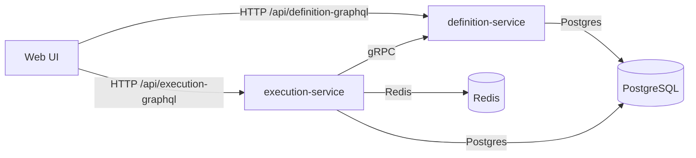

# Auctor Platform

Auctor is a policy-driven workflow execution platform for deterministic decisions and clear execution tracking.
It separates workflow definition from execution to keep governance strict while allowing high-throughput runtime operations.

The stack is documented for local-first runtime, with optional infrastructure assets for teams that want cloud deployment later.

## Architecture


## Tech Stack
| Layer | Tech | Version |
| --- | --- | --- |
| Definition Service | Java, Spring Boot | 21, 3.4.1 |
| Execution Service | Kotlin, Ktor | 2.2.20, 3.0.0 |
| Web | Next.js, React | 14.1.0, 18.3.0 |
| Build | Maven, Gradle | 3.9.9, 8.8 |
| Data | PostgreSQL, Redis | 16, 7.4 |
| Platform | Helm, Terraform | 3.x, 1.6+ |

## Run Locally (Docker Compose)
Prerequisites (fresh machine):
- Docker Engine/Desktop installed
- Docker Compose plugin (`docker compose version` works)
- At least 8 GB RAM available to Docker
- Ports free: `3000`, `3001`, `5432`, `6379`, `8081`, `8082`, `9091`, `16686`

Create the local web env file (one-time setup):
```bash
cp web/.env.example web/.env.local
```
Keep `web/.env.local` local-only (do not commit).
Update `web/.env.local` with your UI auth values before the first login, especially:
- `NEXT_PUBLIC_GOOGLE_CLIENT_ID`
- `GOOGLE_CLIENT_ID`

```bash
docker compose up --build
```

Services:
- Web UI: http://localhost:3000
- Definition API: http://localhost:8081
- Execution GraphQL: http://localhost:8082
- Jaeger UI: http://localhost:16686
- Grafana: http://localhost:3001
- Prometheus: http://localhost:9091

## Run Tests
```bash
# Definition service
cd services/definition-service
mvn test

# Execution service
cd services/execution-service
./gradlew test

# Web
cd web
npm test
```

## Project Structure
- `services/definition-service`: Policy and workflow definition service (Spring Boot)
- `services/execution-service`: Execution runtime service (Ktor)
- `web/`: Next.js web UI
- `infra/terraform/azure`: Azure infrastructure provisioning
- `infra/helm`: Helm chart for Kubernetes deploys
- `infra/argocd`: Argo CD app/project manifests
- `docs/`: Architecture notes, ADRs, and local run guidance

## Design Decisions (Summary)
- Monorepo for shared evolution and consistent release cadence.
- GraphQL for UI-facing definition/execution operations, gRPC for internal service-to-service lookups.
- Google sign-in (current primary login path) with platform JWT issued for backend authorization.
- Versioned immutable definitions for deterministic replay.
- Split persistence models: JPA for definition, Exposed for execution.
- Cache layering: Caffeine + Redis for hot paths.

## Intentional Local Defaults
- Some security controls are intentionally relaxed in local/demo mode to keep setup friction low.
- In local/demo mode, authorization defaults users to `EXECUTOR` by design.
- These defaults are for local operation only and should be hardened for production environments.

## Documentation
- Architecture and flows: [docs/architecture.md](docs/architecture.md)
- ADRs: [docs/decisions.md](docs/decisions.md)
- Local demo runbook: [docs/local-run.md](docs/local-run.md)
- Project operating manual: [docs/project-operating-manual.md](docs/project-operating-manual.md)

## Repository Assets (Optional for Cloud)

The following are present in the repository but are optional for local demo usage:
- Helm templates and values under `infra/helm`
- Terraform modules under `infra/terraform/azure`
- Argo CD manifests under `infra/argocd`
- CI/CD workflows under `.github/workflows`
- Monitoring config under `infra/monitoring`

## Deliberately Not Included
- BPMN engine: focused on deterministic policy workflows.
- Custom auth provider: uses Google identity + platform JWT model.
- Event bus (Kafka): avoided for scope and ops simplicity.
- Full RBAC admin UI: minimized front-end surface.

