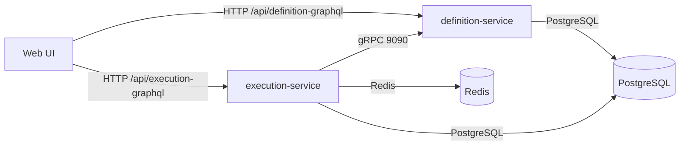

# Architecture

## Service Responsibilities
| Service | Responsibility |
| --- | --- |
| definition-service | Owns policy and workflow definitions, versioning, validation, GraphQL + gRPC APIs |
| execution-service | Executes workflows, evaluates policies, provides GraphQL API, caching, audit log |
| web | UI for policy/workflow authoring and execution dashboards, proxying GraphQL to backend services |

## Protocol Choices
- GraphQL over HTTP for UI reads/mutations to definition and execution domains via web proxy routes.
- gRPC for low-latency, typed calls between services.
- HTTP health/metrics endpoints for operations and observability.

## Authentication Model (Current)
- Web login uses Google Sign-In (`/api/auth/google`) as the primary path.
- After Google token verification, web issues a platform JWT used for backend authorization.
- Backend calls use `Authorization: Bearer <token>` propagated by web proxy routes.
- Optional dev login exists behind `ENABLE_DEV_LOGIN=true` for local-only testing.

## Key Data Flows
### Create Workflow
1) Web submits a `createWorkflow` GraphQL mutation to `/api/definition-graphql`.
2) definition-service validates and writes a new immutable version.
3) Web reads back latest version for display.

### Execute Workflow
1) Web posts GraphQL payload to `/api/execution-graphql`.
2) execution-service fetches definition via gRPC from definition-service.
3) execution-service persists execution state and audit events.
4) execution-service returns results to the UI.

### Policy Evaluation
1) execution-service reads policy via gRPC.
2) evaluation result is cached and emitted as part of audit log.
3) metrics are exported to Prometheus and traces to OTLP.
