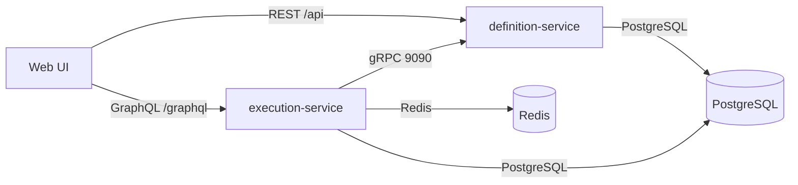

# Architecture

## Service Responsibilities
| Service | Responsibility |
| --- | --- |
| definition-service | Owns policy and workflow definitions, versioning, validation, REST + gRPC APIs |
| execution-service | Executes workflows, evaluates policies, provides GraphQL API, caching, audit log |
| web | UI for policy and workflow authoring, execution dashboards |

## Protocol Choices
- REST for CRUD and lifecycle operations where caching and HTTP semantics are ideal.
- gRPC for low-latency, typed calls between services.
- GraphQL for UI aggregation with flexible query shapes.

## Key Data Flows
### Create Workflow
1) Web submits workflow definition via REST to definition-service.
2) definition-service validates and writes a new immutable version.
3) Web reads back latest version for display.

### Execute Workflow
1) Web triggers execution via GraphQL on execution-service.
2) execution-service fetches definition via gRPC from definition-service.
3) execution-service persists execution state and audit events.
4) execution-service returns results to the UI.

### Policy Evaluation
1) execution-service reads policy via gRPC.
2) evaluation result is cached and emitted as part of audit log.
3) metrics are exported to Prometheus and traces to OTLP.
